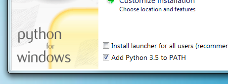

# Active Workspace Extentions Docs Starter

# Getting started

## Check your development environment

Git - If you need to install Git [download from here](https://git-scm.com/). You can also download the [GitHub Desktop App](https://desktop.github.com/) for the point and click people. If you aren't sure... you should probably install it> If nothing else it can't hurt to get the newest version

Open a terminal window. We are big fans of VS Code. It has a terminal built in! Check out [Visual Studio Code](https://code.visualstudio.com/). See
[terminal instructions for Mac users](http://www.macworld.co.uk/feature/mac-software/how-use-terminal-on-mac-3608274/) and
[terminal instructions for Windows users](https://www.quora.com/How-do-I-open-terminal-in-windows). 

Let's check to see if you have the following installed. Follow the list to check if if it is install and then what version you have:
```console
# Check Node
$ node --version
v8.11.1
# Check NPM
$ npm --version
5.6.0
# Check Python
$ python --version
Python 2.7.2
# Check PIP
$ pip --version
pip 1.5.2
```

Pip is a package installer for Python. MkDocs supports Python versions 2.7, 3.4, 3.5, 3.6 and pypy.

If you don't have Node.js installed, go to https://nodejs.org/ and install the
recommended version for your operating system.

## Installing Python

Install [Python](https://www.python.org/downloads/) by downloading an installer appropriate for your system from
[python.org](https://www.python.org/downloads/) and running it.

>If you are installing Python on Windows, be sure to check the box to have Python added to your PATH if the installer offers such an option (it's normally off by default).
>
>

## Installing pip

If you're using a recent version of Python, the Python package manager, [pip],
is most likely installed by default. However, you may need to upgrade pip to the
lasted version:

```console
pip install --upgrade pip
```

If you need to install [pip] for the first time, download [get-pip.py].
Then run the following command to install it:

```console
python get-pip.py
```

## Installing MkDocs

Install the `mkdocs` package using pip:

```console
pip install mkdocs
```

You should now have the `mkdocs` command installed on your system. Run `mkdocs
--version` to check that everything worked okay.

```console
$ mkdocs --version
mkdocs, version 0.15.3
```


>If you are using Windows, some of the above commands may not work out-of-the-box. A quick solution may be to preface every Python command with `python -m` like this:
> 
> ```console
> python -m pip install mkdocs
> python -m mkdocs
>```
>For a more permanent solution, you may need to edit your `PATH` environment
variable to include the `Scripts` directory of your Python installation.
Recent versions of Python include a script to do this for you. Navigate to
your Python installation directory (for example `C:\Python34\`), open the
`Tools`, then `Scripts` folder, and run the `win_add2path.py` file by double
clicking on it. Alternatively, you can [download](https://svn.python.org/projects/python/trunk/Tools/scripts/win_add2path.py) the script and run it
(`python win_add2path.py`).

---

## Installing The Material Theme

[Material requires MkDocs >= 0.17.1](http://www.mkdocs.org).

#### using pip

Material can be installed with `pip`:

```console
pip install mkdocs-material
```

## Additional Extension Installs
These should be added when you install Material, but just to be on the safe side use pip to install `pymdown-extentions`,`pygments` and `fontawesome-markdown`.

```console
pip install pymdown-extensions
```

```console
pip install pygments
```

```console
pip install https://github.com/bmcorser/fontawesome-markdown/archive/master.zip
```


## Clone the Repo

If you are using the terminal, type the line below in the directory you want the site to live:

```
git clone https://github.com/ActiveWorkspaceExtensions/AW-Docs.git
```
You can also clone the repo from the GitHub Desktop App.

Open the directory ```AW-Docs-Site``` in your terminal.

## Now the Fun Part
MkDocs comes with a built-in dev-server that lets you preview your documentation
as you work on it. Make sure you're in the same directory as the `mkdocs.yml`
configuration file, and then start the server by running the `mkdocs serve`
command:

```console
$ mkdocs serve
INFO    -  Building documentation...
INFO    -  Cleaning site directory
[I 160402 15:50:43 server:271] Serving on http://127.0.0.1:8000
[I 160402 15:50:43 handlers:58] Start watching changes
[I 160402 15:50:43 handlers:60] Start detecting changes
```

Open up `http://127.0.0.1:8000/` in your browser, and you'll see the Active Workspace Docs Site is displayed.

## How To Work In MKDOCS
There's a single configuration file named `mkdocs.yml`, and a folder named
`docs` that will contain your documentation source files. The folder named `site` is the built site that needs to be commited to the [ActiveWorkspaceExtensions.github.io](https://github.com/ActiveWorkspaceExtensions/ActiveWorkspaceExtensions.github.io) repo.

New pages go in their own folder in the `docs` directory. Add images in the page directory. An example would be ``. 

Add pages the same fashion as the other pages in the `mkdocs.yml` file:

```yml
# Pages
pages:
  - Home: index.md
  - Getting Started: 
    - Environment Setup: Getting-Started/Environment-Setup/Environment-Setup.md
    - My First Extension: Getting-Started/My-First-Extension/My-First-Extension.md
  - Docs:
    - What is Declarative: Documentation/What-is-Declarative/What-is-Declarative.md
    - Examples:
      - Location Example: Documentation/Examples/Location-Example/Location-Example.md
  - Extensions:
    - HomeFolderLinkcmdGlobal: Extensions/HomeFolderLinkcmdGlobal/HomeFolderLinkcmdGlobal.md
    - InboxLinkcmdGlobal: Extensions/InboxLinkcmdGlobal/InboxLinkcmdGlobal.md
    - QuickLinksCmdPanel: Extensions/QuickLinksCmdPanel/QuickLinksCmdPanel.md
    - at4Create: Extensions/at4Create/at4Create.md
```

## Building the site

>#### Note on Directory Structure Build Directories
>When AW-Docs is built, it will try to make it easier to publish the site by adding the build files to the ```ActiveWorkspaceExtensions.github.io/``` directory, as long as it is in the same directory as ```AW-Docs```:
    
>It is recommended that you also clone the site directory:
>   ```console
>    GitHub/
>    ├── ActiveWorkspaceExtensions.github.io/
>    ├── AW-Docs/
>     ```

That's looking good. You're ready to deploy the first pass of your `MkLorum`
documentation. First build the documentation:

```console
mkdocs build
```

This will create a new directory, named `site`.

After some time, files may be removed from the documentation but they will still
reside in the `site` directory. To remove those stale files, just run `mkdocs`
with the `--clean` switch.

```console
mkdocs build --clean
```

## Other Commands and Options

There are various other commands and options available. For a complete list of
commands, use the `--help` flag:

```console
mkdocs --help
```

To view a list of options available on a given command, use the `--help` flag
with that command. For example, to get a list of all options available for the
`build` command run the following:

```console
mkdocs build --help
```


## Markdown Help

Markdown is pretty cool, but there is a special way to get things styled the way you want it. Check out the [Markdown Guide](https://www.markdownguide.org/getting-started) to help you get started.