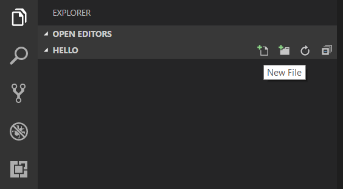
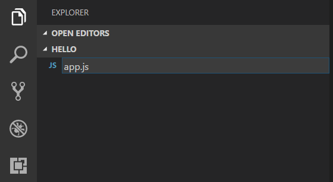

# Environment Setup 

## Visual Studio Code
To Start out, we need a place to write code and use the command line. Don't worry. Visual Studio Code will make this much easier. Download [Visual Studio Code](https://code.visualstudio.com/). 

[](https://code.visualstudio.com/)

## Node.js
[Node.js](https://nodejs.org/) is a platform for building fast and scalable server applications using JavaScript. Node.js is the runtime and [NPM](https://www.npmjs.com/) is the Package Manager for Node.js modules.

Visual Studio Code has support for the JavaScript and TypeScript languages out-of-the-box as well as Node.js debugging. However, to run a Node.js application, you will need to install the Node.js runtime on your machine.

To get started in this walkthrough, [install Node.js for your platform](https://nodejs.org/en/download/). The Node Package Manager is included in the Node.js distribution. You'll need to open a new terminal (command prompt) for the `node` and `npm` command line tools to be on your PATH.

>**Linux**: There are specific Node.js packages available for the various flavors of Linux. See [Installing Node.js via package manager](https://nodejs.org/en/download/package-manager) to find the Node.js package and installation instructions tailored to your version of Linux.

>**Tip:** To test that you've got Node.js correctly installed on your computer, open a new terminal and type `node --help` and you should see the usage documentation.

## Node.js Hello World

Every good tutorial starts off with a "Hello World" Example. Let's get started by creating the simplest Node.js application to get our feet wet with Visual Studio Code.

Create an empty folder called "hello", navigate into and open VS Code:

```bash
mkdir hello
cd hello
code .
```

>**Tip:** You can open files or folders directly from the command line.  The period '.' refers to the current folder, therefore VS Code will start and open the `Hello` folder.

From the File Explorer tool bar, press the New File button:



and name the file `app.js`:



By using the `.js` file extension, VS Code interprets this file as JavaScript and will evaluate the contents with the JavaScript language service.

Create a simple string variable in `app.js` and send the contents of the string to the console:

```javascript
var msg = 'Hello World';
console.log(msg);
```

Note that when you typed `console.` IntelliSense on the `console` object was automatically presented to you.


Also notice that VS Code knows that `msg` is a string based on the initialization to `'Hello World'`.  If you type `msg.` you'll see IntelliSense showing all of the string functions available on `msg`.


After experimenting with IntelliSense, revert any extra changes from the source code example above and save the file (`kb(workbench.action.files.save)`).

### Running Hello World

It's simple to run `app.js` with Node.js. From a terminal, just type:

```bash
node app.js
```

You should see "Hello World" output to the terminal and then Node.js returns.

### Integrated Terminal

VS Code has an [integrated terminal](https://code.visualstudio.com/docs/editor/integrated-terminal) which you can use to run shell commands. You can run Node.js directly from there and avoid switching out of VS Code while running command line tools.

**View** > **Integrated Terminal** (`kb(workbench.action.terminal.toggleTerminal)` with the backtick character) will open the integrated terminal and you can run `node app.js` there:


## Express.js

[Express](https://expressjs.com/) is a very popular application framework for building and running Node.js applications. You can scaffold (create) a new Express application using the Express Generator tool. The Express Generator is shipped as an NPM module and installed by using the NPM command line tool `npm`. We use Express to create a local server run on your computer. This lets you view Active Workspace with your changes as you are working on it, before you put it in production.

>**Tip:** To test that you've got `npm` correctly installed on your computer, type `npm --help` from a terminal and you should see the usage documentation.

Install the Express Generator by running the following from a terminal:

```bash
npm install -g express-generator
```

The `-g` switch installs the Express Generator globally on your machine so you can run it from anywhere.

## Java 7 JDK 1.7.0_17

We need to download [Java 7 JDK 1.7.0_17](http://www.oracle.com/technetwork/java/javase/downloads/java-archive-downloads-javase7-521261.html) for the scripts to run.

[](http://www.oracle.com/technetwork/java/javase/downloads/java-archive-downloads-javase7-521261.html)

Now that we have that installed, we need to set our JAVA_HOME path, so the scripts know where it is.

 - Right click My Computer and select Properties.
 - On the Advanced tab, select Environment Variables 
 - and then edit JAVA_HOME to point to where the JDK software is located, for example, C:\Program Files\Java\1.7.0_17.

If you have any issues, Oracle has an article on [Installing the JDK Software and Setting JAVA_HOME](https://docs.oracle.com/cd/E19182-01/821-0917/inst_jdk_javahome_t/index.html)

## Setting Up Source Code
### Make a Directory
Make a new folder that will contain all of our code. I like having all of my projects in one folder on my root drive. For example `C:\dev\MyProject`. Place it at your liking. This can be done through the File Explorer or through the terminal. To make directories in command prompt:
 - Navigate to the directory to make a new folder.
 - `mkdir newproject`
 - `cd newproject`
 - `code .` will open the project in VS Code 

### Active Workspace Code
Now we need the Active Workspace code inside of this project.

Go to TC_ROOT/aws2/stage/src/out/war/assets<numbers>/

Copy the `stage` folder and paste into your New Project directory. I have found that due to the size of the folder, It helped to zip it up before copy and pasting. Then expand the zip in the folder. 

### Update Proxy Server
Open the `stage/build/express.js` file in VS Code.


Change the URLs to the TC Server. While we can run Active Workspace locally, we still need TeamCenter connected for all of the data.

## Set Up Express
inside of the integrated terminal for your project we created earlier run the following commands:
 - `run npm install express`
 - `npm install http-proxy`
 - `npm install`

You may want to take a minute and grab a coffee. This will take a few minutes to install everything. This installs what we require for express to run.

## Start The Server

Once everything is completed, run `express.cmd`


Now you have your own local Active Workspace deployment that you can play around with… To make changes on the fly utilize your custom modules and run `warRefresh.cmd` from the terminal to see your changes automagically.