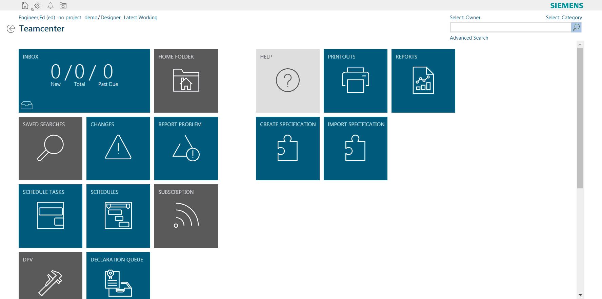

# HomeFolderLinkcmdGlobal Extension

## Visual Studio Code

[Download the extension from GitHub :fa-github:](https://github.com/ActiveWorkspaceExtensions/HomeFolderLinkcmdGlobal)

!!! info "This tutorial example is for Active Workspace 4.0"

The global command bar in active workspace allows for generic links to be made that can help reduce clicks or input time to get to a certain location.

{: .shadow}

The HomeFolderLinkcmdGlobal extension does just this. Instead of having to click home then home folder, this module places a home folder command in the global toolbar. The command will take any user to their home folder, no matter where they are in the client.  

The example also shows how to use JavaScript and services to get information required to build the url for the home folder. The home folder itself is just a URl constructed based upon the users home folder UID. The location is just a `showObject` location. An example would be something like this:

```javascript
com.siemens.splm.clientfx.tcui.xrt.showObject?s_uid=gofF7D0qqd$DyB&uid=gofF7D0qqd$DyB
```

The first part, `com.siemens.splm.clientfx.tcui.xrt.showObject`, is the location being used. This location needs a uid input to display whatever object needs to be displayed though. The UID for my home folder is the `gofF7D0qqd$DyB`. So how do we get that uid from the client? We need to use a service to find it.

Inside of the module.json you will find the actions associated with this command. The action `activateHomeFolderLinkcmdGlobal` is actually a service being called from some javascript.

``` json
"actions": {
            "activateHomeFolderLinkcmdGlobal": {
                "actionType": "JSFunction",
                "method": "getProperties",
                "deps": "soa/dataManagementService",
                "inputData": {
                    "uids": [
                        "{{ctx.user.uid}}"
                    ],
                    "propNames": [
                        "home_folder"
                    ]
                },
                "outputData": {
                    "ctx.user": "{{dataParseDefinitions:updateUserCtxForHomeFolder}}"
                },
                "events": {
                    "success": [{
                        "name": "showHomeFolderLink"
                    }]
                }
            },
```
 
So here we can see the action type as a `JSFunction`. This calls a JavaScript function from a certain file based on the two attributes, method and deps. `Method` defines the method you want to use in the function. `Deps` defines the file you want to use. So this example specifically defines the method to be used as `getProperties` in the file located in `soa/dataManagementService` in your war file. (technically its within assets/js/soa/dataManagementService but it starts looking in the js folder initially).

``` json hl_lines="4 5"
"actions": {
            "activateHomeFolderLinkcmdGlobal": {
                "actionType": "JSFunction",
                "method": "getProperties",
                "deps": "soa/dataManagementService",
```
 
So now we know the method and the file its located in so we can find its inputs: 

``` javascript
exports.getProperties = function( uids, propNames ) 
```
So the inputs are `uids` and `propNames` for the uids.  We can provide that in the JSON as well:

``` json
"inputData": {
                    "uids": [
                        "{{ctx.user.uid}}"
                    ],
                    "propNames": [
                        "home_folder"
                    ]
                },
```

 
A reference type is a data type that refers to an object in memory. We know the home folder property is a typedReference on the user object. Getting the uid for that should be simple. The input for uids should be the user uid. We can get that through ctx just as we did above with ctx.user.uid.  We can easily see the ctx data if we run `window._jsniInjector.service('appCtxService').ctx`. The property on the user object we want is a typedReference which will return the UID of the typedReference object. On the User object that property is home_folder like above.

Now that all of the inputs are solid we need to handle the output of the data, and put it in a position for easy access when we build the url for the link.

``` json
"outputData": {
                    "ctx.user": "{{dataParseDefinitions:updateUserCtxForHomeFolder}}"
                },
```
 
Here we are going to take the output of the method above and create our own `ctx.user.<something>` that we can access when we click the link.  

``` json
"dataParseDefinitions": {
            "updateUserCtxForHomeFolder": {
                "outputFormatType": "ViewModelObject",
                "dataInput": "plain[0]",
                "operationType": "CREATE"
            }
        }
```
 
So from above in outputData we defined a `dataParseDefinition` to call which is `updateUserCtxForHomeFolder`. This `dataParseDefinitions` is taking the output format which will be a `ViewModelObject`. We git this from the typedReference `home_folder` property from the User object above. And, we are going to create that property under `ctx.user` so we have access to it. The `dataInput` here is from the service return since we know there is only 1 object that should be returned here.  

We now a have finished the service call, a success with our return, and updated a property on ctx.user. We now have access to the home folder UID. We can now make an event action to make the link. This event is just going to call an action `showHomeFolderLink`:

``` json
"onEvent": [{
            "eventId": "showHomeFolderLink",
            "action": "showHomeFolderLink"
        }],
```
 
This event occurs from the initial action `activateHomeFolderLinkcmdGlobal` success. As long as the service and the ctx.user update are successful, then we will call the event `showHomeFolderLink`:

``` json
"showHomeFolderLink": {
                "actionType": "Navigate",
                "navigateTo": "com_siemens_splm_clientfx_tcui_xrt_showObject",
                "navigationParams": {
                    "uid": "{{ctx.user.props.home_folder.dbValues[0]}}",
                    "cmdId": "{{commandContext.cmdId}}",
                    "cmdArg": "{{commandContext.cmdArgs}}"
                }
            }
```

In AW 4.0 there is a new `actionType`. This actionType is called `Navigate` which can help replace any javascript code that generates and executes a URL in the same tab. The attributes are populated to determine where in AW you want to send the user. For this example we are going to send them to showObject location which is the `com_siemens_splm_clientfx_tcui_xrt_showObject` above. There are parameters we can apply to this as well, since `showObject` has a UID. From earlier we looked at how this is updating the `ctx.user` props to allow us to use it later. This is where we use it.  The uid in `navigationParams` can be set based on what we did earlier. `ctx.user.props.home_folder.dbValues[0]` is now the uid of the users `home_folder` which we need to generate the URL.  `cmdID` and `cmdArg` are used for tiles actually in the values you can generate there.  For this example we can ignore them.

In the end here is what the final product does:

{: .shadow}