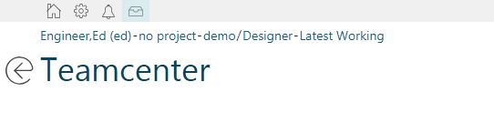

# InboxLinkcmdGlobal Extension

[Download the extension from GitHub :fa-github:](https://github.com/ActiveWorkspaceExtensions/InboxLinkcmdGlobal)

## What This Extension Does

!!! info "This tutorial example works for Active Workspace 3.4 & 4.0"

The global command bar in active workspace allows for generic links to be made that can help reduce clicks or input time to get to a certain location.

{: .shadow}

The InboxLinkcmdGlobal extension does just this. As opposed to going back to the home screen to get to your inbox, this extension will add a link to the global header. The link will take you directly to the users inbox. 
  
## Overview of the Extension
This extension is composed of the `module.json`, a `InboxLinkcmdGlobalMessages.json` that contains the copy for the extension, and a `InboxLinkCmdGlobalService.js` that constructs the URL to the inbox. The `module.json` gives a good tour through the extension:

```JSON tab="module.json"
{
    "name": "InboxLinkcmdGlobal",
    "desc": "Global link for inbox",
    "type": [
        "native"
    ],
    "skipTest": true,
    "commandsViewModel": {
        "commands": {
            "InboxLinkCmdGlobal": {
                "iconId": "homeInbox",
                "title": "{{i18n.InboxLinkCmdGlobalTitle}}"
            }
        },
        "commandHandlers": {
            "InboxLinkCmdGlobalHandler": {
                "id": "InboxLinkCmdGlobal",
                "action": "activateInboxLinkCmdGlobal",
                "activeWhen": true,
                "visibleWhen": true
            }
        },
        "commandPlacements": {
            "InboxLinkCmdGlobalaw_globalToolbar": {
                "id": "InboxLinkCmdGlobal",
                "uiAnchor": "aw_globalToolbar",
                "priority": 100
            }
        },
        "actions": {
            "activateInboxLinkCmdGlobal": {
                "actionType": "JSFunction",
                "method": "go",
                "deps": "js/InboxLinkCmdGlobalService",
                "inputData": {
                    "location": "#/teamTasks",
                    "userUID": ""
                }
            }
        },
        "i18n": {
            "InboxLinkCmdGlobalTitle": [
                "InboxLinkcmdGlobalMessages"
            ]
        }
    }
}
```

```JavaScript tab="InboxLinkCmdGlobalService.js"
define(["app", "js/logService", "js/browserUtils", "js/locationNavigation.service", "js/NotyModule"], //
    function (app, logger, browserUtils) {
        'use strict';
        var exports = {},
            _$state = null;

        exports.go = function (location, uUID) {
                _$state = browserUtils.getBaseURL() + location + uUID;
                window.open(_$state, "_self");
            }
        return exports;

});
```

```JSON tab="InboxLinkcmdGlobalMessages.json"
{
    "InboxLinkCmdGlobalTitle": "Inbox",
    "header": "Header",
    "body": "Body",
    "footer": "Footer",
    "checkBoxName": "Enable the OK button in footer",
    "save": "Ok"
}
```

## Module.json Breakdown

We start off with the extension information at the top of the file. Please refer to the docs for a better understanding.

```json
{
    "name": "InboxLinkcmdGlobal",
    "desc": "Global link for inbox",
    "type": [
        "native"
    ],
    "skipTest": true,
```

## Commands View Model

This part of the `module.json` file goes through the view model commands. For this extension there is one command, `InboxLinkCmdGlobal`. It will use an icon and get the title from the `InboxLinkcmdGlobalMessages.json` file with the corresponding ID.

```json
"commandsViewModel": {
        "commands": {
            "InboxLinkCmdGlobal": {
                "iconId": "homeInbox",
                "title": "{{i18n.InboxLinkCmdGlobalTitle}}"
            }
        },
```

## Command Handler

The command handler manages actions from commands. This is a good example of a fairly straight forward one. By clicking on the `InboxLinkCmdGlobal`, it triggers an action `activateInboxLinkCmdGlobal`.

```json
"commandHandlers": {
            "InboxLinkCmdGlobalHandler": {
                "id": "InboxLinkCmdGlobal",
                "action": "activateInboxLinkCmdGlobal",
                "activeWhen": true,
                "visibleWhen": true
            }
        },
```

## Command Placement
This tells Active Workspace where to place the command.

```json
"commandPlacements": {
            "InboxLinkCmdGlobalaw_globalToolbar": {
                "id": "InboxLinkCmdGlobal",
                "uiAnchor": "aw_globalToolbar",
                "priority": 100
            }
        },
```

## Action
This sets up the action that we were calling above. The `activateInboxLinkCmdGlobal` action uses s JavaScript function found in `js/InboxLinkCmdGlobalService` to call a mathod named `go`. I passes in a location and a user id.

```json
"actions": {
            "activateInboxLinkCmdGlobal": {
                "actionType": "JSFunction",
                "method": "go",
                "deps": "js/InboxLinkCmdGlobalService",
                "inputData": {
                    "location": "#/teamTasks",
                    "userUID": ""
                }
            }
        },
```

## Messages
This last piece tells Active Workspace where to find all of the copy for the titles, messages, etc.

```json
"i18n": {
            "InboxLinkCmdGlobalTitle": [
                "InboxLinkcmdGlobalMessages"
            ]
        }
```

## End Product

In the end this extension will add the icon (highlighted below for reference only). The icon will link to the users inbox.

{: .shadow}