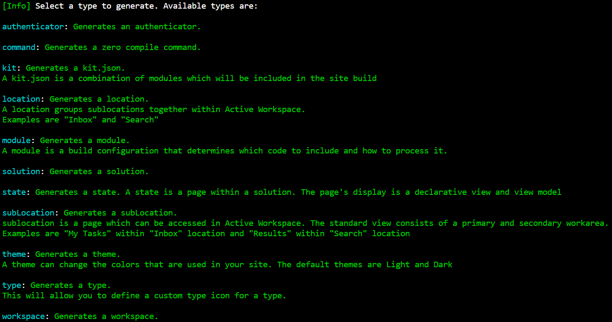
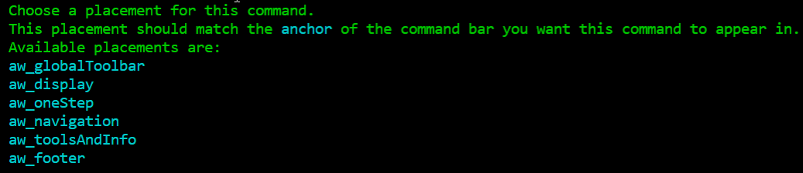
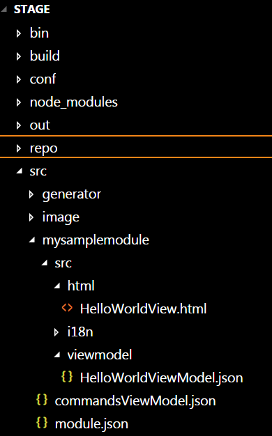

!!! note 
    **AW Version**:  This tutorial is for Active Workspace version 4.0+ and may have some differences between the same steps in earlier versions.

Active Workspace is a Teamcenter Client that utilizes web technologies like node.js, angularjs and others to meet the needs of many engineering, manufacturing and other systems around the world.  With these technologies na modern web development we can extend the Active Workspace to automate tasks on the client or display data a certain way.

To get started with this walkthrough make sure your [environment is setup](http://activeworkspaceextensions.github.io/Getting-Started/Environment-Setup/Environment-Setup/), and if you were able to have [express running](https://activeworkspaceextensions.github.io/Getting-Started/Environment-Setup/Environment-Setup/#expressjs).

There are a few ways to create an extension within Active Workspace.  For this tutorial however we will go over the generator that comes with the client and how to generate a tools and info panel.

Initialize the environment with `initenv.cmd`, this is located directly inside the Stage directory.  Next go ahead and type `generateModule` to see the list of modules you can create.

Go ahead and for the type to generate type `Command`.  My command name is going to be `HelloWorld`. My Icon will by `cmdCheckmark`, the icon can be any icon included in the `stage/src/images` folder.  You can even put your own svg icons in there to use.

Command placement is where we will determine the anchor for this command.  Anchor is a good description for what this does.  Somewhere in our html we declare an anchor in a command bar, that anchor we can then use to display certain commands.  OOTB command anchors are those listed in the `generateModule`.

Like said earlier in this tutorial we will use the `aw_toolsAndInfo` anchor which is the right side commands.  After typing `aw_toolsAndInfo` into the placement name it will generate `HelloWorldViewModel.json`, `HelloWorldView.html` inside of Stage/src under the new `mysamplemodule` directory.  

The Definition of your new command is inside `commandsViewModel.json` under `mysamplemodule`.  The view and viewmodel are generated under the src directory.

Now you can run a `gwtcompile` or `warRefresh` to compile the client and view your deployed changes with your new war file:

